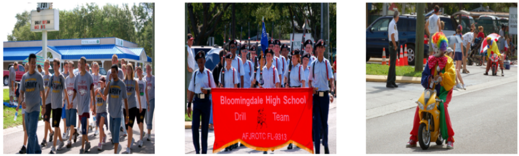

# Zero Shot Visual Storytelling

Zero shot visual storytelling, using GPT-2 and CLIP and beam search. See [the paper](assets/zeroshot_visual_storytelling.pdf) for more details.

_This work was submitted to COSE474-2021F Deep Learning @ Korea University_

## Example output of our methods.

<!-- #region -->

> This is a picturising scenario involving a group of people playing with a toy. The game is a single player or group game with three or four players.

<!-- #region -->

> 39 men in America's annual yearly military academy (walking the steps to the stratosphere). Learn more about how Arizona organized military schools (#IGCF) organize, organise, and in action!

## How to use

To perform VIST Dataset evaluation, you need to first download the dataset. Executing `downloader.py` will download the dataset.

Next, evaluate our method on the VIST dataset. Executing `main.py` will evaluate our method on the VIST dataset.

On main.py, you can use just the language model evaluation, by setting `test_baseline` to `True`.

By running storyteller.py, you can see the storyteller's output on given `story_id`.
